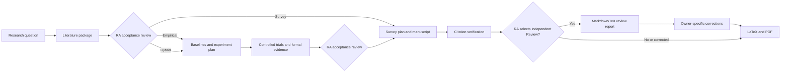

# EasyResearch

[](https://www.npmjs.com/package/easyresearch)
[](https://github.com/hdu-ailab/EasyResearch/actions/workflows/release.yml)
[](./LICENSE)

[简体中文](./README_zh.md)

> **From a research question to verifiable paper artifacts.**

An AI research team that searches, experiments, writes, draws, and reviews. Start a
literature review or a bounded experiment campaign with one instruction; every
step leaves sources, logs, results, and checkpoints you can inspect.

## Install

### Desktop App

The desktop app bundles the matching native EasyResearch backend. It does not
require a global npm installation, Node, or Bun.

| System | Download | Install |
|---|---|---|
| Windows x64 | [`EasyResearch-<version>-windows-x64.exe`](https://github.com/hdu-ailab/EasyResearch/releases/latest) | Run the installer. |
| macOS Apple silicon | [`EasyResearch-<version>-macos-arm64.dmg`](https://github.com/hdu-ailab/EasyResearch/releases/latest) | Open the DMG and drag EasyResearch to Applications. |
| Linux | No desktop package | Use the npm CLI below. |

1. Open the [latest GitHub Release](https://github.com/hdu-ailab/EasyResearch/releases/latest).
2. Download the installer for your platform and `SHA256SUMS`.
3. Compare the installer hash with `SHA256SUMS` before opening it:

```powershell
Get-FileHash -Algorithm SHA256 .\EasyResearch-*-windows-x64.exe
```

```bash
shasum -a 256 EasyResearch-*-macos-arm64.dmg
```

GitHub build-provenance attestations can also be checked with:

```bash
gh attestation verify /path/to/downloaded/installer --repo hdu-ailab/EasyResearch
```

The installers are currently unsigned. After verifying the download, Windows
users can choose **More info** and **Run anyway** if SmartScreen warns. On
macOS, right-click EasyResearch and choose **Open** if Gatekeeper blocks the
first launch.

Desktop and CLI share `~/.easyresearch/agent` state but cannot run at the same
time. Starting Desktop stops a running CLI service; CLI start and exit commands
are rejected while Desktop owns the state. Closing the window keeps Desktop
active in the tray or menu bar; use **Exit** there to cancel active work and stop
the backend. Desktop updates are manual downloads from GitHub Releases.

### npm CLI

```bash
npm install -g easyresearch@latest
easyresearch
```

EasyResearch opens a local Web workspace. Choose a project directory, connect a
model provider in **Settings**, and describe the outcome you want.

## Start With An Outcome

| Automated literature review | Autoresearch | Full paper pipeline |
|---|---|---|
| **From a topic to a cited review draft.** Search OpenReview and arXiv, verify metadata, read PDFs, organize the literature, and produce Markdown, LaTeX, or PDF. | **Keep improving one metric within a budget.** Run baselines, form hypotheses, execute trials, retain improvements, roll back failures, and record every result. | **Turn an idea into connected research artifacts.** Coordinate literature, experiments, editable figures, manuscript text, and PDF instead of returning disconnected chat advice. |

### Generate a literature review

```text
/research-project-workflow Survey recent methods for few-shot bearing fault diagnosis.
Collect and verify the literature first, then prepare a cited review draft.
```

### Automatically optimize an experiment

```text
/autoresearch Improve validation macro-F1 for the current method. Keep the
evaluation split fixed, run at most 20 trials, and limit each trial to 30 minutes.
```

Autoresearch starts only after explicit authorization. You define the objective,
evaluator, mutable scope, budget, rollback rule, and stopping conditions. An
exploratory winner must still pass the normal multi-seed and robustness checks
before it becomes formal paper evidence.

### Run the complete paper workflow

```text
/research-project-workflow Build a reproducible study of lightweight fault
diagnosis under domain shift, from literature collection through the final PDF.
```

After each specialist finishes, the Research Assistant checks the reported
artifacts and advances automatically when they satisfy the authorized goal. It
asks only for missing access or authority, consequential evidence tradeoffs, or
safety and resource decisions; incomplete evidence is never silently converted
into manuscript claims.

## Useful Commands

Every Skill loaded by the current Agent is available as `/<skill-name>`. If a
Skill name conflicts with another command, the composer displays
`/skill:<skill-name>` and only that explicit form invokes the Skill.

| Command | Use it for |
|---|---|
| `/autoresearch <goal>` | Run a bounded, metric-driven experiment optimization campaign. |
| `/research-project-workflow <topic>` | Start or organize an end-to-end paper project. |
| `/customize-easyresearch <request>` | Ask the Research Assistant to add or modify an Agent or Skill. |
| `/find-skills <need>` | Find installable Skills for a missing capability. |
| `/skill-creator <idea>` | Create a reusable Skill for a specialized workflow. |
| `/name <name>` | Rename the current research session; bare `/name` clears it. |

Commands are shortcuts, not requirements. You can request the same outcomes in
ordinary language.

## Not Another AI Writing Tool

EasyResearch is not a general chatbot with a longer system prompt. Research work
is split across specialists with explicit responsibility boundaries:

| Agent | Owns | Does not do |
|---|---|---|
| **Research Assistant** | Route classification, evidence inspection, specialist dispatch, acceptance review, authorized SSH preflight, and autoresearch coordination | Create specialist artifacts or run experiments itself |
| **Search** | Retrieval, metadata verification, permitted PDFs, readable text, and per-paper factual material notes | Write cross-paper synthesis or manuscript prose |
| **Experiment** | Baselines, methods, controlled trials, records, and formal evidence | Draft the paper or invent results |
| **Writing** | Empirical/survey readiness, survey taxonomy and coverage, citation verification, authorized drafting, LaTeX, and PDF | Run experiments or fill evidence gaps with guesses |
| **Figures** | Editable publication figures grounded in sources and results | Invent claims or values |
| **Review** | Independent source-based review reports over accepted Markdown/TeX and evidence | Edit manuscripts, run experiments, or decide acceptance |

Fresh specialists run in isolated sessions and can work in parallel when their
goals and output paths do not overlap. Every normally terminating specialist
writes a timestamped handoff listing its inputs, work files, findings, gaps, and
next action.

## Research Pipeline



The Research Assistant coordinates the flow, but Search, Experiment, Writing,
Figures, and Review remain the owners of their artifacts. Review runs once by
default when the Research Assistant selects it; another review is explicit.

## Inspect The Outputs

The bundled workflows use a transparent project layout by default. Existing
projects can keep an explicitly supplied layout.

| Artifact | What you can verify |
|---|---|
| `ref_papers/source.json` | Selected papers, identifiers, metadata, and acquisition/conversion failures |
| `ref_papers/pdf/` and `ref_papers/text/` | Original permitted PDFs and the readable evidence used downstream |
| `ref_papers/paper-notes.md` | Per-paper questions, methods, evidence, limitations, relevance, and source locators |
| `experiments/experiment-record.md` or `experiment_ssh/experiment-record.md` | Baseline, hypotheses, trial decisions, commands, metrics, failures, and remaining budget for local or SSH execution |
| Selected root's `results/` and `logs/` | Formal outputs, seed-level results, and execution history; SSH projects are mounted at `experiment_ssh/` |
| `manuscript/survey-plan.md` | Survey scope, candidate taxonomies, final outline, coverage matrix, and claim-source plan |
| `manuscript/citation-verification.md` | Which citations and claims were checked and which remain uncertain |
| `manuscript/manuscript.md` | The authoritative manuscript source |
| `figures/` | Editable evidence-grounded publication figures and exports |
| `handoffs/<role>-<timestamp>.md` | One immutable specialist-run summary with every input and created/modified work-file path |
| `reviews/review_report-<timestamp>.md` | Independent findings over the supplied Markdown/TeX sources and evidence |
| `manuscript/manuscript.pdf` | The derived paper PDF |

The actual files are the handoff between stages. A chat message is not treated
as proof that a research stage is complete.

## Evidence, Reproducibility, Control

- **Evidence first:** material claims must trace to a paper source or experiment
  output; uncertain references are reported rather than silently completed.
- **Reproducible experiments:** configurations, commands, metrics, seeds,
  failures, negative trials, and formal results stay in the research record.
- **Automatic but bounded:** unattended work has an explicit goal, evaluator,
  mutable scope, budget, rollback behavior, and stop conditions.
- **Minimal interruption:** the Research Assistant advances accepted work inside
  your original authorization and asks only when access, authority, evidence
  standards, safety, or resource consequences require your decision.
- **Long-running work:** supervised background sessions, persisted state, and
  explicit continuation let useful work survive beyond one chat response.
- **Paper-level delivery:** authoritative Markdown, derived LaTeX/PDF, and
  editable figures remain directly inspectable.

## Models And Extensibility

- Assign different models and thinking strengths to different Agents.
- Connect built-in providers, OpenAI-compatible endpoints, local model servers,
  or custom providers.
- Keep project files and sessions isolated by exact local directory; whether a
  cloud model receives content is controlled by your provider configuration.
- Add domain workflows without framework code: Agents are Markdown files and
  Skills are `SKILL.md` resources.

The recommended path is the Web UI:

- Use **Settings** to connect providers and choose Agent models.
- Use `/customize-easyresearch` to ask the Research Assistant to create or edit
  Agents and Skills.

For manual configuration:

- [Model and provider configuration](./docs/model-configuration.md)
- [Agent and Skill customization](./docs/agent-customization.md)

## Runtime Notes

- The npm CLI supports Linux x64, Apple Silicon macOS, and Windows x64. Its
  selected platform executable needs neither Node nor Bun.
- Windows runs natively through PowerShell and does not require WSL or Git Bash.
- Python 3 on PATH enables PDF conversion and arXiv SDK features. Bundled Web
  search does not depend on Python. Startup degrades gracefully when Python is
  unavailable.

The first run extracts bundled Agents and Skills and creates their Python
environment. The CLI reports progress in the terminal; Desktop reports it in
the loading window. Keep the selected app open until setup finishes.

## CLI

```bash
easyresearch                   # start the local Web workspace and open it
easyresearch -p 4000           # use another port
easyresearch --host 0.0.0.0    # listen on another interface
easyresearch --no-open         # do not open a browser
easyresearch exit              # stop the background service
easyresearch --version
```

The default server is local at `http://127.0.0.1:3000` and has no Web
authentication. Do not expose it to an untrusted network.

## Development

```bash
git clone https://github.com/hdu-ailab/EasyResearch.git
cd EasyResearch
bun install --frozen-lockfile
bun run check:web
```

Production releases are standalone native binaries. Runtime or packaging
changes must also pass a native compiled smoke test.

## License

[MIT](./LICENSE)
