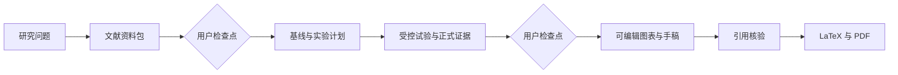

# EasyResearch

[](https://www.npmjs.com/package/easyresearch)
[](https://github.com/hdu-ailab/EasyResearch/actions/workflows/release.yml)
[](./LICENSE)

[English](./README.md)

> **从研究问题到可验证的论文产物。**

一支会检索、实验、写作和制图的 AI 研究团队。用一条指令启动文献综述或有边界的
自动实验优化，每一步都保留可检查的来源、日志、结果与检查点。

```bash
npm install -g easyresearch@latest
easyresearch
```

EasyResearch 会打开本地 Web 工作区。选择一个项目目录，在**设置**中连接模型
provider，然后描述你想得到的成果。

## 从成果出发

| 自动文献综述 | Autoresearch | 完整论文流水线 |
|---|---|---|
| **从主题到带引用的综述初稿。** 检索 OpenReview 与 arXiv，核验元数据，阅读 PDF，整理文献，并生成 Markdown、LaTeX 或 PDF。 | **在预算内持续优化一个指标。** 运行基线、提出假设、执行试验、保留改进、回滚失败方案，并记录所有结果。 | **把研究想法变成相互关联的产物。** 串联文献、实验、可编辑图表、论文正文与 PDF，而不是返回零散的聊天建议。 |

### 生成文献综述

```text
/research-project-workflow 调研近期少样本轴承故障诊断方法。
先收集并核验文献，再准备一份带引用的综述草稿。
```

### 自动优化实验

```text
/autoresearch 提升当前方法的验证集 macro-F1。固定评估划分，最多运行 20 次试验，
每次试验不超过 30 分钟。
```

Autoresearch 只会在你明确授权后启动。你负责确定目标、评估器、可修改范围、预算、
回滚规则和停止条件。探索阶段的最优结果仍需通过常规多 seed 与稳健性验证，才能
成为正式论文证据。

### 运行完整论文流程

```text
/research-project-workflow 完成一项面向域偏移的轻量故障诊断可复现研究，
从文献收集一直推进到最终 PDF。
```

重要阶段仍会在有意义的用户检查点停下。流水线不会把不完整证据静默包装成论文结论。

## 常用命令

当前 Agent 加载的每个 Skill 都可通过 `/<skill-name>` 调用。若 Skill 名称与其他命令
冲突，候选项会显示 `/skill:<skill-name>`，且只有该显式形式会调用 Skill。

| 命令 | 用途 |
|---|---|
| `/autoresearch <目标>` | 发起有边界、由指标驱动的自动实验优化活动。 |
| `/research-project-workflow <主题>` | 启动或整理端到端论文项目。 |
| `/customize-easyresearch <需求>` | 让研究助手添加或修改 Agent、Skill。 |
| `/find-skills <需求>` | 为缺失能力查找可安装 Skills。 |
| `/skill-creator <想法>` | 为专门工作流创建可复用 Skill。 |
| `/name <名称>` | 重命名当前研究会话；单独输入 `/name` 可清空名称。 |

命令只是快捷入口，不是硬性要求；同样的成果也可以直接通过自然语言提出。

## 不是普通 AI 写作工具

EasyResearch 不是给通用聊天机器人换一个更长的 system prompt。研究工作由职责边界
明确的专家分别承担：

| Agent | 负责 | 不负责 |
|---|---|---|
| **研究助手** | 澄清需求、检查证据、派发任务、管理检查点和协调已授权的 autoresearch | 亲自创建专家产物 |
| **检索** | 资料检索、元数据核验、允许获取的 PDF、可读文本和文献资料包 | 撰写综述或论文正文 |
| **实验** | 基线、方法、受控试验、记录和正式证据 | 起草论文或编造结果 |
| **写作** | 准备度检查、引用核验、已授权写作、LaTeX 和 PDF | 运行实验或猜测缺失证据 |
| **图表** | 基于来源和结果的可编辑投稿图表 | 编造结论或数值 |

目标和输出路径不重叠时，新专家会在隔离会话中并行工作。后台任务会持久化状态，并
返回成果路径、尚未解决的缺口和一个建议的下一步行动。

## 研究流水线



研究助手负责协调流程，但检索、实验、写作和图表 Agent 始终是各自产物的负责人。

## 直接检查产物

内置工作流默认使用透明的项目布局；已有项目也可以继续使用任务中明确指定的布局。

| 产物 | 可以核查什么 |
|---|---|
| `ref_papers/source.json` | 已选论文、标识符、元数据，以及获取或转换失败记录 |
| `ref_papers/pdf/` 与 `ref_papers/text/` | 合法获取的原始 PDF 和下游实际读取的文本证据 |
| `experiments/experiment-record.md` | 基线、假设、试验决策、命令、指标、失败和剩余预算 |
| `experiments/results/` 与 `experiments/logs/` | 正式结果、各 seed 输出和执行历史 |
| `manuscript/citation-verification.md` | 哪些引用与结论已经核验，哪些仍不确定 |
| `manuscript/manuscript.md` | 权威手稿源文件 |
| `figures/` | 基于证据的可编辑投稿图表及导出文件 |
| `manuscript/manuscript.pdf` | 从权威手稿派生的论文 PDF |

阶段之间通过真实磁盘文件交接。单独一条聊天消息不会被当作研究阶段已经完成的证明。

## 证据、复现与控制

- **证据优先：** 重要结论必须追溯到论文来源或实验输出；不确定引用会被明确报告，
  而不是静默补全。
- **实验可复现：** 配置、命令、指标、seed、失败、负结果和正式结果都会进入研究记录。
- **自动但有边界：** 无人值守任务必须有明确目标、评估器、可修改范围、预算、回滚
  行为和停止条件。
- **用户检查点：** 从文献进入实验、从证据进入完整写作等关键转折由你批准。
- **长期任务可继续：** 受监督的后台会话、持久化状态和显式继续机制，使任务不受单次
  聊天响应限制。
- **论文级交付：** 权威 Markdown、派生 LaTeX/PDF 和可编辑图表都可直接检查。

## 模型与扩展能力

- 可为不同 Agent 指定不同模型和思考强度。
- 可连接内置 provider、OpenAI 兼容端点、本地模型服务或自定义 provider。
- 项目文件与会话按精确本地目录隔离；内容是否发送给云端模型由你的 provider 配置
  决定。
- 无需修改框架代码即可增加领域流程：Agents 是 Markdown 文件，Skills 是
  `SKILL.md` 资源。

推荐使用 Web UI：

- 在**设置**中连接 provider 并选择 Agent 模型。
- 使用 `/customize-easyresearch`，让研究助手创建或修改 Agents 与 Skills。

需要手工配置时，请阅读：

- [模型与 provider 配置](./docs/model-configuration.zh-CN.md)
- [Agent 与 Skill 定制](./docs/agent-customization.zh-CN.md)

## 安装说明

- 原生支持 Linux x64、Apple Silicon macOS 和 Windows x64。
- 被选中的平台可执行文件本身不需要 Node 或 Bun。
- Windows 通过 PowerShell 原生运行，不需要 WSL 或 Git Bash。
- `PATH` 中的 Python 3 用于 PDF 转换、arXiv SDK 功能和内置 Web 检索；缺少
  Python 时，启动会降级而不是直接失败。

首次运行会解压内置 Agents 与 Skills，并创建所需 Python 环境。终端会显示安装进度，
请等待引导完成。

## CLI

```bash
easyresearch                   # 启动本地 Web 工作区并打开浏览器
easyresearch -p 4000           # 使用其他端口
easyresearch --host 0.0.0.0    # 监听其他网卡
easyresearch --no-open         # 不自动打开浏览器
easyresearch exit              # 停止后台服务
easyresearch --version
```

默认服务位于 `http://127.0.0.1:3000`，且没有 Web 身份验证。不要将其暴露到不可信
网络。

## 开发

```bash
git clone https://github.com/hdu-ailab/EasyResearch.git
cd EasyResearch
bun install --frozen-lockfile
bun run check:web
```

正式发布物是独立原生二进制。涉及运行时或打包的变更还必须通过原生编译 smoke
测试。

## 许可证

[MIT](./LICENSE)
